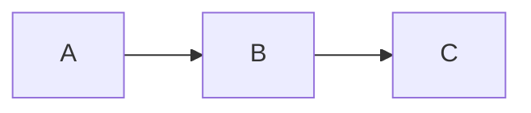

# tui-md


Markdown rendering components for [OpenTUI](https://github.com/anomalyco/opentui.git) React applications.

`tui-md` is a library, not a standalone CLI. It exports a React component that renders rich markdown inside an OpenTUI terminal app — with syntax-highlighted code blocks, LaTeX math, Mermaid diagrams, tables, GFM extensions, and interactive clickable links.

## Install

```bash
bun add tui-md @opentui/core @opentui/react react
```

`@opentui/core`, `@opentui/react`, and `react` are peer dependencies, so your app controls their versions.

## Features

- CommonMark plus GFM tables, task lists, strikethrough, autolinks, footnotes, front matter, math, definition lists, abbreviations, gemoji, and GitHub alert blockquotes.
- Syntax-highlighted fenced code blocks using OpenTUI's native `<code>` component.
- Diff and patch blocks rendered with OpenTUI's unified diff view.
- Mermaid diagrams rendered as terminal-friendly ASCII art through `beautiful-mermaid`.
- LaTeX display and inline math rendered as Unicode art without an external binary.
- Images rendered as OpenTUI-contained terminal cell art through `chafa`, avoiding sixel/graphics-layer leaks into terminal scrollback.
- Wide code, Mermaid, diff, and table blocks get contained scrolling instead of polluting the main page layout.
- Inline overflow blocks support mouse wheel and click-drag scrolling, then hand scrolling back to the main page when the block reaches an edge.
- Wide tables keep measured natural column widths and scroll horizontally only; vertical mouse wheel movement continues to scroll the document.
- Clickable links with hover styling, built-in open handling, file path support, and custom `onLinkClick` override.
- Theme tokens for text, headings, links, code, math, tables, alerts, keyboard keys, highlights, and diffs.
- Streaming mode for live markdown output with an appended block cursor.

## Basic Usage

```tsx
import { render } from "@opentui/react";
import { Markdown } from "tui-md";

render(
  <Markdown
    content={"# Hello\n\nThis is **markdown** rendered in OpenTUI."}
  />
);
```

## API

```tsx
import {
  Markdown,
  defaultTheme,
  parse,
  parseStreaming,
  resolveTheme,
  type MarkdownProps,
  type TuiMdLinkHandler,
  type TuiMdTheme,
} from "tui-md";
```

### `<Markdown />`

```tsx
<Markdown
  content={markdown}
  streaming={false}
  width="100%"
  theme={{ link: "#8be9fd" }}
  onLinkClick={(url) => {
    // Optional: let the host app decide how links should behave.
  }}
/>
```

**Props:**

| Prop | Type | Default | Description |
| --- | --- | --- | --- |
| `content` | `string` | required | Markdown source to render. |
| `streaming` | `boolean` | `false` | Appends a block cursor (`█`) to the last text node for streaming/live output. |
| `width` | `number \| string` | `"100%"` | Width passed to the root OpenTUI box. |
| `theme` | `Partial<TuiMdTheme>` | `{}` | Color overrides merged with `defaultTheme`. |
| `onLinkClick` | `TuiMdLinkHandler` | built-in opener | Optional link click handler. |

---

## Supported Markdown

`tui-md` uses a unified/remark pipeline with the following plugins to cover standard CommonMark plus a wide set of extensions:

### Block elements

| Feature | Syntax |
| --- | --- |
| Headings (H1–H6) | `# … ######` |
| Paragraphs | plain text |
| Blockquotes | `> …` |
| Ordered lists | `1. …` |
| Unordered lists | `- …` / `* …` / `+ …` |
| Task lists | `- [x] done` / `- [ ] todo` |
| Thematic breaks | `---` |
| Front matter | YAML fenced with `---` |
| Definition lists | `Term\n: description` |
| Footnote definitions | `[^label]: …` |
| Tables | GFM pipe syntax |
| Fenced code blocks | ` ```lang … ``` ` |
| Math (display) | `$$…$$` |
| GitHub alerts | `> [!NOTE]`, `[!TIP]`, `[!IMPORTANT]`, `[!WARNING]`, `[!CAUTION]` |
| Mermaid diagrams | ` ```mermaid … ``` ` |
| Diff/patch blocks | ` ```diff … ``` ` |

### Inline elements

| Feature | Syntax |
| --- | --- |
| Bold | `**text**` / `__text__` |
| Italic | `*text*` / `_text_` |
| Strikethrough | `~~text~~` |
| Inline code | `` `code` `` |
| Links | `[label](url)` |
| Inline math | `$…$` |
| Footnote references | `[^label]` |
| Highlight / mark | `==text==` |
| Abbreviations | `*[KEY]: definition` (auto-expands throughout the document) |
| Gemoji shortcodes | `:smile:`, `:rocket:`, etc. |
| Superscript | `<sup>text</sup>` |
| Subscript | `<sub>text</sub>` |
| Keyboard keys | `<kbd>Ctrl</kbd>` / `<kbd>Ctrl+S</kbd>` |
| Underline | `<u>text</u>` |
| Insert (diff add) | `<ins>text</ins>` |
| Delete (diff del) | `<del>text</del>` |
| Small text | `<small>text</small>` |
| Inline code (HTML) | `<code>`, `<samp>`, `<tt>` |
| Line breaks | `<br>` |

> **Note:** Unrecognized inline HTML tags are treated as transparent passthroughs — their children are rendered with current text attributes.

---

## Rendering Details

### Syntax-highlighted code blocks

All fenced code blocks are rendered with full syntax highlighting powered by OpenTUI's `<code>` component using a GitHub Dark–inspired token style. The language label is shown above the block.

```markdown
```typescript
const greet = (name: string) => `Hello, ${name}!`;
```
```

### Diff blocks

Fenced blocks with `diff` or `patch` as their language are rendered with OpenTUI's native unified diff view — additions in green, deletions in red.

### Mermaid diagrams

Fenced blocks with `mermaid` as their language are rendered as terminal-friendly ASCII art via the [`beautiful-mermaid`](https://github.com/nicholasgasior/beautiful-mermaid) package.

```markdown

```

### LaTeX math

Math expressions are rendered as genuine Unicode art by a built-in TypeScript port of [TeXicode](https://github.com/nicholasgasior/texicode) — no subprocess or external binary required. This produces real stacked fractions, vertical integral signs, positioned super/subscripts, and proper `√` glyphs.

- **Display math** — `$$…$$` or a fenced `math` block — is centered in its own box.
- **Inline math** — `$…$` — is rendered inline within text.

Results are cached in memory so re-renders of the same expression are free.

### Tables

Tables are rendered with full Unicode box-drawing borders (`┌─┬─┐ │ ├─┼─┤ └─┴─┘`). Column widths are automatically measured by scanning cell content. If a table is wider than the terminal, it keeps its natural width and becomes horizontally scrollable instead of squeezing columns.

Column alignment (`left`, `center`, `right`) from the GFM alignment marker is respected.

Wide tables use horizontal-only mouse wheel and click-drag scrolling. Vertical wheel events continue to the page scroll, and horizontal scrolling hands back to the parent when the table reaches either edge.

### Images

Images are downloaded and rendered as terminal cell art via `chafa --format=symbols --colors=full`. The output is parsed into OpenTUI text spans, so images stay inside the normal render tree and do not leave sixel/terminal-graphics artifacts behind when the document scrolls or rerenders.

If `chafa` is not installed, `tui-md` renders an inline error message instead of failing the whole markdown render.

### Contained overflow scrolling

Wide or tall fenced code, Mermaid, and diff blocks are rendered inside contained OpenTUI scrollboxes. Mouse wheel and click-drag gestures scroll the inline block while it can move; once the block reaches the top, bottom, left, or right edge, wheel events bubble back to the main document scrollbox.

### GitHub alerts

`> [!NOTE]`, `> [!TIP]`, `> [!IMPORTANT]`, `> [!WARNING]`, and `> [!CAUTION]` are rendered as styled callout blocks with a colored left border and a bold badge label:

- **NOTE** — blue (`#0969da`)
- **TIP** — green (`#1a7f37`)
- **IMPORTANT** — purple (`#8250df`)
- **WARNING** — amber (`#bf8700`)
- **CAUTION** — red (`#cf222e`)

### Front matter

YAML front matter (fenced with `---`) is displayed in a rounded border box labelled **FRONT MATTER** in muted colour.

### Keyboard keys

`<kbd>` tags are rendered as styled key caps with a background tint and bracketed notation. Compound keys like `<kbd>Ctrl+S</kbd>` are split on `+` and each key rendered individually with a `+` separator.

### Superscript & subscript

`<sup>` and `<sub>` tags map to Unicode superscript/subscript characters where the Unicode block covers them (digits, many lowercase/uppercase letters, common symbols). When a character has no Unicode equivalent the whole string falls back to `^(text)` or `_(text)` notation.

### Streaming mode

Set `streaming={true}` to append a `█` block cursor to the last text leaf in the AST on every render. This is designed for live/streaming content where the markdown source grows token by token.

```tsx
<Markdown content={partialContent} streaming={true} />
```

---

## Link Handling

### Default built-in opener

Clicked links use the package's built-in multi-strategy opener:

1. `http`, `https`, and `mailto` links → system default browser/app (`xdg-open` on Linux, `open` on macOS, `start` on Windows).
2. File paths (relative or `file://`) → tried in order:
   - `$VISUAL` or `$EDITOR` environment variable.
   - GUI editor: `code`, `code-insiders`.
   - Inline terminal editor (suspends/resumes the OpenTUI renderer): `nvim`, `vim`, `nano`, `vi`.
   - Terminal editor in a new terminal window: `x-terminal-emulator`, `gnome-terminal`, `konsole`, `xfce4-terminal`, `alacritty`, `kitty`, `wezterm`.
   - System file association (`xdg-open` / `open`).
3. If the file does not exist, an inline error message is shown next to the link.

Links highlight on hover and change colour when hovered (uses `theme.accent` + `theme.codeBg`).

### Custom handler

Pass `onLinkClick` to take full control:

```tsx
<Markdown
  content="[Open docs](https://example.com)"
  onLinkClick={(url) => {
    console.log("link clicked", url);
  }}
/>
```

Return an error result to display an inline failure message beside the link:

```tsx
<Markdown
  content="[Missing file](./missing.md)"
  onLinkClick={() => ({
    ok: false,
    reason: "file-not-found",
    message: "File not found",
  })}
/>
```

**`TuiMdLinkHandler` signature:**

```ts
type TuiMdLinkHandler = (url: string) =>
  void | OpenUrlResult | Promise<void | OpenUrlResult>;

type OpenUrlResult =
  | { ok: true }
  | { ok: false; reason: "file-not-found" | "open-failed"; path?: string; message: string };
```

---

## Theming

All colours are defined in `TuiMdTheme`. Pass a partial object to `<Markdown theme={…} />` — it is merged with `defaultTheme`.

```tsx
import { Markdown, defaultTheme } from "tui-md";

<Markdown
  content={markdown}
  theme={{
    ...defaultTheme,
    text: "#f8f8f2",
    link: "#8be9fd",
    codeBg: "#282a36",
  }}
/>
```

### `TuiMdTheme` tokens

| Token | Default | Used for |
| --- | --- | --- |
| `text` | `#d4d4d4` | Body text |
| `muted` | `#6b6b6b` | Heading prefixes, blockquote gutter, footnote labels, front matter |
| `accent` | `#569cd6` | Link hover colour, heading fallback, definition list terms |
| `border` | `#3c3c3c` | Table borders, blockquote bar, thematic break |
| `link` | `#4ec9b0` | Link default colour |
| `code` | `#ce9178` | Inline code foreground |
| `codeBg` | `#1e1e1e` | Inline code & code block background |
| `math` | `#dcdcaa` | Math expressions |
| `list` | `#569cd6` | List bullets and numbers |
| `kbd` | `#d4d4d4` | Keyboard key foreground |
| `kbdBg` | `#3c3c3c` | Keyboard key background |
| `highlightFg` | `#000000` | `==mark==` foreground |
| `highlightBg` | `#ffff00` | `==mark==` background |
| `diffAdd` | `#4ec9b0` | `<ins>` / diff `+` lines |
| `diffDel` | `#f44747` | `<del>` / diff `-` lines, link error messages |
| `h1` | `#4ec9b0` | H1 heading colour |
| `h2` | `#569cd6` | H2 heading colour |
| `h3` | `#c586c0` | H3 heading colour |
| `h4` | `#dcdcaa` | H4 heading colour |
| `h5` | `#ce9178` | H5 heading colour |
| `h6` | `#6b6b6b` | H6 heading colour |

### `resolveTheme`

```ts
import { resolveTheme, defaultTheme } from "tui-md";

const theme = resolveTheme({ link: "#8be9fd" });
// => { ...defaultTheme, link: "#8be9fd" }
```

---

## Parser Helpers

`parse` and `parseStreaming` are exported for apps that need access to the markdown AST before (or instead of) rendering. Both return an `mdast` `Root` node with all custom transformations already applied.

```ts
import { parse, parseStreaming } from "tui-md";

// Standard parse
const ast = parse("# Title\n\n==highlighted==");

// Streaming parse — injects a block cursor into the last text leaf
const ast = parseStreaming("# Title\n\nPartial sen");
```

The full remark pipeline applied during parsing:

| Plugin | Purpose |
| --- | --- |
| `remark-parse` | CommonMark base |
| `remark-frontmatter` | YAML front matter |
| `remark-gfm` | Tables, strikethrough, task lists, autolinks |
| `remark-math` | `$…$` and `$$…$$` math |
| `remark-definition-list` | Definition list syntax |
| `remarkAbbr` (built-in) | `*[KEY]: def` abbreviations |
| `remarkMergeInlineHtml` (built-in) | Merges open/close HTML tag pairs into a single node |
| `remarkMark` (built-in) | `==text==` highlight syntax |
| `remarkGemoji` (built-in) | `:shortcode:` emoji expansion |
| `remark-github-blockquote-alert` | GitHub-style `[!NOTE]` / `[!WARNING]` alerts |

---

## Development

```bash
bun install
bun run test          # typechecks + builds
bun run typecheck     # typecheck only
bun run test:interactive  # launch the interactive OpenTUI demo
npm pack --dry-run    # preview what gets published to npm
```

`bun run test` runs TypeScript typechecking followed by the production build into `dist/`. `npm pack --dry-run` shows exactly what would be published.

### Interactive demo

```bash
bun run test:interactive
```

Launches a live OpenTUI app (`tests/interactive.tsx`) that renders a rich markdown document covering every supported feature — useful for visually validating changes.

---

## License

MIT
