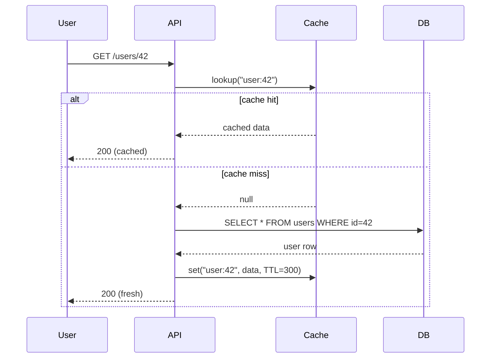
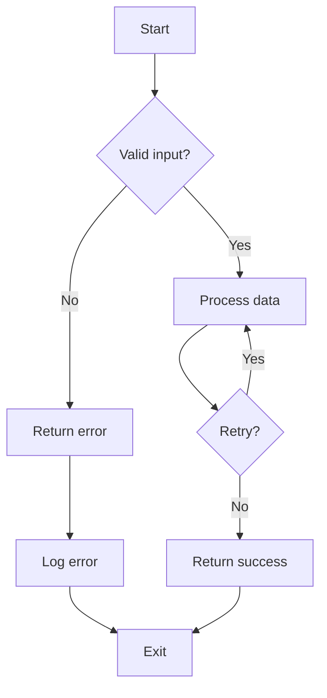

# Markdown Demonstration

This document showcases the full breadth of Markdown syntax. Every feature is demonstrated with both rendered output and the raw syntax.

---

## 1. Headings

# H1
## H2
### H3
#### H4
##### H5
###### H6

## 2. Paragraphs and Line Breaks

This is a paragraph. It contains **bold**, *italic*, ***bold italic***, `inline code`, ~~strikethrough~~, and <sub>subscript</sub> / <sup>superscript</sup> text.

This is a second paragraph after a blank line.  
Two trailing spaces produce a hard line break (visible above).

## 3. Text Emphasis

|Style|Syntax|Output|
|---|---|---|
|Italic|`*text*` / `_text_`|*text*|
|Bold|`**text**` / `__text__`|**text**|
|Bold+Italic|`***text***` / `___text___` / `**__text__**`|***text***|
|Strikethrough|`~~text~~`|~~text~~|
|Inline code|`` `code` ``|`code`|
|Highlight (GFM)|`==text==`|==text==|
|Subscript|`<sub>text</sub>`|<sub>text</sub>|
|Superscript|`<sup>text</sup>`|<sup>text</sup>|
|Underline|`<u>text</u>`|<u>text</u>|
|Keyboard|`<kbd>Ctrl+C</kbd>`|<kbd>Ctrl+C</kbd>|
|Mark|`<mark>text</mark>`|<mark>text</mark>|
|Small|`<small>text</small>`|<small>text</small>|
|Inserted|`<ins>text</ins>`|<ins>text</ins>|
|Deleted|`<del>text</del>`|<del>text</del>|

## 4. Blockquotes

> This is a blockquote.
> It can span multiple lines.
>
> > Nested blockquote.
>
> * Lists inside blockquotes.
> 1. Numbered items too.
>
>     Code blocks inside blockquotes (4-space indent):
>
>         const x = 42;

## 5. Lists

### Unordered

* Red
* Green
* Blue
  * Light blue
  * Dark blue
    * Navy
* Yellow

### Ordered

1. First item
2. Second item
   1. Sub-item 2a
   2. Sub-item 2b
3. Third item
   1. Sub-item 3a
      1. Sub-sub-item 3a.i
      2. Sub-sub-item 3a.ii

### Task List (GFM)

- [x] Write the press release
- [ ] Update the website
- [ ] Contact the media
- [ ] Prep briefing deck
  - [x] Slide 1: Title
  - [ ] Slide 2: Metrics
  - [ ] Slide 3: Timeline

### Definition List

Term 1
: Definition 1

Term 2 with _inline markup_
: Definition 2
: Second definition for Term 2

## 6. Code

### Inline Code

Use `console.log("hello")` to print. The function `map(fn, xs)` applies `fn` to each `xs` element.

### Fenced Code Block

```javascript
import { createServer } from "node:http";

const handler = (req, res) => {
  res.writeHead(200, { "Content-Type": "application/json" });
  res.end(JSON.stringify({ status: "ok", uptime: process.uptime() }));
};

createServer(handler).listen(3000, () => {
  console.log("listening on port 3000");
});
```

### Fenced Code Block with Diff

```diff
-function greet(name) {
-  return "Hello, " + name;
+function greet(name) {
+  return `Hello, ${name}`;
 }
```

### Indented Code Block

    def fibonacci(n):
        a, b = 0, 1
        for _ in range(n):
            yield a
            a, b = b, a + b

## 7. Horizontal Rules

---

***

___

## 8. Links

### Inline Link

[GitHub](https://github.com)

### Link with Title

[GitHub](https://github.com "The world's largest developer platform")

### Reference Link

[GitHub][1]

[1]: https://github.com

### Relative Link

See the [README](README.md) for setup instructions.

### Email Link

[Email support](mailto:dummy@example.com)

### File Link

[Relative dummy file](README.md)

### File URI Link

[File URI dummy](file://README.md)

### Missing File Link

[Missing dummy file](missing-dummy-file.md)

### Automatic Link

<https://example.com>

## 10. Tables

| Left-aligned | Center-aligned | Right-aligned |
|:-------------|:--------------:|--------------:|
| Apple        |     Banana     |          $1.50 |
| Orange       |    Grapefruit  |          $2.00 |
| Pear         |    Watermelon  |          $3.75 |

### Table with Multi-line Content and Alignment

| Feature | Status | Priority | Notes |
|:--------|:------:|:--------:|:------|
| Authentication | Done | P0 | OAuth2 + JWT |
| Rate Limiting | Done | P1 | 100 req/min per user |
| Caching | In Progress | P1 | Redis backend |
| Webhooks | Not Started | P2 | Design TBD |
| Export | Not Started | P3 | CSV, PDF, JSON |
| Dark Mode | In Progress | P3 | Design approved |

### Table with Inline Markdown

| Metric | Value | Trend |
|:-------|:-----:|:-----:|
| **CPU** | `23.4%` | *stable* |
| **Memory** | `1.2 GB` | **growing** |
| **Disk I/O** | `45 MB/s` | *dropping* |
| **Network** | `1.2 Gbps` | *flat* |
| **Error Rate** | `0.02%` | **falling** |

## 11. Footnotes

Here is a sentence with a footnote.[^1]

[^1]: This is the footnote content. It can span multiple lines and contain **markdown**.

Another reference.[^custom-note]

[^custom-note]: Custom identifier footnotes work too.

## 12. Abbreviations

The HTML specification is maintained by the W3C.

*[HTML]: Hyper Text Markup Language
*[W3C]: World Wide Web Consortium

## 14. Math (LaTeX via KaTeX)

### Inline Math

Greek letters and constants: $\alpha$, $\beta$, $\gamma$, $\delta$, $\varepsilon$, $\zeta$, $\eta$, $\theta$, $\lambda$, $\mu$, $\pi$, $\sigma$, $\phi$, $\omega$, $\Omega$, $\infty$.

Energy–mass equivalence: $E = mc^2$. Euler's identity: $e^{i\pi} + 1 = 0$.

The quadratic formula gives roots $x = \frac{-b \pm \sqrt{b^2 - 4ac}}{2a}$ for $ax^2 + bx + c = 0$.

A function is continuous at $x_0$ if $\lim_{x \to x_0} f(x) = f(x_0)$.

The golden ratio $\varphi = \frac{1 + \sqrt{5}}{2} \approx 1.618$.

### Block Math — Calculus & Analysis

Gaussian integral:

$$
\int_{-\infty}^{\infty} e^{-x^2} \, dx = \sqrt{\pi}
$$

Fundamental theorem of calculus:

$$
\int_a^b f'(x) \, dx = f(b) - f(a)
$$

Taylor series expansion:

$$
f(x) = \sum_{n=0}^{\infty} \frac{f^{(n)}(a)}{n!}(x - a)^n
$$

Basel problem (Euler, 1734):

$$
\sum_{n=1}^{\infty} \frac{1}{n^2} = \frac{\pi^2}{6}
$$

### Block Math — Algebra & Combinatorics

Binomial theorem:

$$
\sum_{k=0}^{n} \binom{n}{k} x^k y^{n-k} = (x + y)^n
$$

Quadratic formula:

$$
x = \frac{-b \pm \sqrt{b^2 - 4ac}}{2a}
$$

Determinant of a 2×2 matrix:

$$
\det\begin{pmatrix} a & b \\ c & d \end{pmatrix} = ad - bc
$$

### Block Math — Physics (Maxwell's Equations)

Gauss's law for electricity:

$$
\nabla \cdot \mathbf{E} = \frac{\rho}{\varepsilon_0}
$$

Gauss's law for magnetism:

$$
\nabla \cdot \mathbf{B} = 0
$$

Faraday's law of induction:

$$
\nabla \times \mathbf{E} = -\frac{\partial \mathbf{B}}{\partial t}
$$

Ampère–Maxwell law:

$$
\nabla \times \mathbf{B} = \mu_0 \left( \mathbf{J} + \varepsilon_0 \frac{\partial \mathbf{E}}{\partial t} \right)
$$

Schrödinger equation:

$$
i\hbar \frac{\partial}{\partial t} \Psi(\mathbf{r}, t) = \hat{H} \Psi(\mathbf{r}, t)
$$

### Block Math — Statistics & Probability

Normal distribution PDF:

$$
f(x) = \frac{1}{\sigma\sqrt{2\pi}} e^{-\frac{(x-\mu)^2}{2\sigma^2}}
$$

Bayes' theorem:

$$
P(A \mid B) = \frac{P(B \mid A)\, P(A)}{P(B)}
$$

### Block Math — Matrix Operations

General 3×3 matrix:

$$
\begin{pmatrix}
a_{11} & a_{12} & a_{13} \\
a_{21} & a_{22} & a_{23} \\
a_{31} & a_{32} & a_{33}
\end{pmatrix}
$$

### Inline Math in Tables

| Expression | LaTeX | Unicode Rendered |
|:-----------|:------|:----------------|
| Energy | `$E = mc^2$` | $E = mc^2$ |
| Pythagorean | `$a^2 + b^2 = c^2$` | $a^2 + b^2 = c^2$ |
| Euler | `$e^{i\pi} + 1 = 0$` | $e^{i\pi} + 1 = 0$ |
| Golden ratio | `$\varphi = \frac{1+\sqrt{5}}{2}$` | $\varphi = \frac{1+\sqrt{5}}{2}$ |


## 15. Admonitions / Callouts (GFM-style with blockquote extension)

> [!NOTE]
> Useful information that users should know, even when skimming.

> [!TIP]
> Helpful advice for doing things better or more easily.

> [!IMPORTANT]
> Key information users need to know to achieve their goal.

> [!WARNING]
> Urgent info that needs immediate user attention to avoid problems.

> [!CAUTION]
> Advises about risks or negative outcomes of certain actions.

## 18. Emoji (Shortcodes)

:smile: :rocket: :heart: :fire: :warning: :checkered_flag: :white_check_mark: :x: :heavy_plus_sign: :heavy_minus_sign: :arrow_up: :arrow_down: :link: :memo: :bulb: :loudspeaker: :star: :zap: :bug: :wrench: :hammer: :package: :books: :microscope: :bar_chart: :chart_with_upwards_trend: :chart_with_downwards_trend: :fast_forward: :rewind: :1234: :hash: :key: :lock: :unlock: :envelope: :calendar: :alarm_clock: :hourglass: :gear: :mag: :mag_right: :computer: :floppy_disk: :file_folder: :open_file_folder: :page_facing_up: :page_with_curl: :clipboard: :pushpin: :paperclip: :triangular_ruler: :scissors: :link: :chains: :tada:

## 19. Escaping Special Characters

| Sequence | Renders as |
|:---------|:-----------|
| `\*`     | * (literal asterisk) |
| `\#`     | # (literal hash) |
| `` \` `` | ` (literal backtick) |
| `\[`     | [ (literal bracket) |
| `\!`     | ! (literal exclamation) |

## 20. Comments

<!-- This is an HTML comment. It will not be rendered. -->

[//]: # (This is a Markdown comment. It also will not be rendered.)

## 21. Combined / Complex Structures

### Nested Containers

> **API Response Example**
>
> ```json
> {
>   "status": 200,
>   "data": {
>     "id": "abc-123",
>     "name": "Widget Pro",
>     "metadata": {
>       "tags": ["featured", "new"],
>       "published": true
>     }
>   },
>   "pagination": {
>     "page": 1,
>     "total_pages": 25,
>     "per_page": 50
>   }
> }
> ```
>
> | Field | Type | Description |
> |:------|:----:|:------------|
> | `id` | string | Unique identifier |
> | `name` | string | Display name |

### Table within List

* **Project Structure**
  * `/src` — source code
    - Controllers, services, middleware
  * `/tests` — test suites
    - Unit, integration, e2e
  * `/docs` — documentation

  | Directory | Purpose | Owner |
  |:----------|:--------|:------|
  | `src/api/` | HTTP handlers | Platform team |
  | `src/core/` | Business logic | Core team |
  | `src/db/` | Data access | Data team |

### Code Block with Admonition

> [!TIP]
> Use the table below to quickly reference HTTP status codes.

| Code | Name | Meaning |
|:----:|:-----|:--------|
| 200 | OK | Request succeeded |
| 201 | Created | Resource created |
| 400 | Bad Request | Malformed syntax |
| 401 | Unauthorized | Authentication required |
| 403 | Forbidden | No permission |
| 404 | Not Found | Resource missing |
| 500 | Internal Server Error | Server failure |
| 502 | Bad Gateway | Upstream failed |
| 503 | Service Unavailable | Temporarily overloaded |

### LaTeX + Code + Table Flow

**Quadratic formula:**

$$
x = \frac{-b \pm \sqrt{b^2 - 4ac}}{2a}
$$

**Implementation in Python:**

```python
import cmath

def quadratic(a: float, b: float, c: float) -> tuple[complex, complex]:
    d = (b**2) - (4 * a * c)
    x1 = (-b - cmath.sqrt(d)) / (2 * a)
    x2 = (-b + cmath.sqrt(d)) / (2 * a)
    return x1, x2
```

| Input | Expected `x1` | Expected `x2` |
|:------|:-------------:|:-------------:|
| `a=1, b=-3, c=2` | `2.0` | `1.0` |
| `a=1, b=2, c=5` | `-1-2j` | `-1+2j` |

## 22. Mermaid / Diagrams





## 23. Deeply Nested List

- Level 1
  - Level 2
    - Level 3
      - Level 4
        - Level 5
          - Level 6
            1. Numbered 1
            2. Numbered 2
               - Back to bullet
                 - Deeper
          - Back to 6
        - Back to 4
      - Back to 3
    - Back to 2
      - Another 2
        - 3 again
          > Quote at level 4
          >
          > > Double nested quote at level 5
  - Level 2 again
- Level 1 again

## 24. Long Paragraph with All Inline Features

The **quick** *brown* ~~fox~~ ***jumps*** over the ==lazy== dog <sup>[1]</sup> `run()` returns `true` when the `$flag` is set and the <kbd>Enter</kbd> key is pressed. The algorithm runs in O(n log n)<sub>avg</sub> time, which is <mark>significantly faster</mark> than the naive O(n) approach. See 3.2 in the [specification](https://example.com) for details. The following variable `x: number` represents the <ins>cumulative</ins> sum, while `y: string` represents the <del>deprecated</del> format string. Event handling uses the `EventEmitter` pattern -- call `.on("data", cb)` to subscribe. The `map` function applies `fn` to each element and returns a new array. Error handling uses `try/catch/finally` blocks. Also note the `useEffect` hook in React triggers <sub>side effects</sub> after <sup>render</sup>. The `await` keyword pauses execution until the <u>Promise</u> resolves. Finally, `export default` exposes the module's <small>primary</small> interface.

## 25. YAML Front Matter

```yaml
---
title: "State of the Union 2025"
author: "Engineering Team"
date: 2025-06-02
version: 2.4.0
status: draft
tags:
  - report
  - quarterly
  - engineering
---
```

## 27. Data Table (Wide / Dense)

| Method | Endpoint | Auth | Rate Limit | Cache | Idempotent | Latency p99 | Deprecated Since |
|:-------|:---------|:----:|:----------:|:-----:|:----------:|:-----------:|:----------------:|
| `GET` | `/v1/users` | Bearer | 100/h | 60s | Yes | 45ms | -- |
| `GET` | `/v1/users/:id` | Bearer | 300/h | 120s | Yes | 23ms | -- |
| `POST` | `/v1/users` | Bearer | 50/h | No | No | 120ms | -- |
| `PATCH` | `/v1/users/:id` | Bearer | 100/h | Purge | Yes | 67ms | -- |
| `DELETE` | `/v1/users/:id` | Admin | 20/h | Purge | Yes | 89ms | -- |
| `GET` | `/v2/users` | Bearer | 1000/h | 30s | Yes | 12ms | v2.1 |
| `POST` | `/v2/users/batch` | Service | 10/h | No | Yes | 340ms | v2.1 |
| `PUT` | `/v1/legacy` | Basic | -- | -- | No | 500ms | v1.0 (EOL) |

## 28. Side-by-Side Comparison via Tables

| Feature | Unix Way | Windows Way |
|:--------|:---------|:------------|
| Package manager | `apt`, `brew`, `pacman` | `winget`, `choco` |
| Shell | `bash`, `zsh`, `fish` | `cmd`, `PowerShell` |
| File system | Ext4, ZFS, Btrfs | NTFS, ReFS |
| Init system | systemd, OpenRC | Service Manager |
| Kernel | Linux, BSD, Darwin | NT kernel |
| Config | `/etc/`, `~/.config/` | Registry, `%AppData%` |
| Line endings | LF (`\n`) | CRLF (`\r\n`) |

## 29. Escape-All-The-Things Table

| Raw | Escaped |
|:----|:--------|
| `*not italic*` | \*not italic\* |
| `**not bold**` | \*\*not bold\*\* |
| `` `not code` `` | \`not code\` |
| `~~no strikethrough~~` | \~\~no strikethrough\~\~ |
| `# not heading` | \# not heading |
| `1. not ordered` | 1\. not ordered |
| `- not bullet` | \- not bullet |
| `> not blockquote` | \> not blockquote |
| `[not a link](url)` | \[not a link](url) |
| `!not an image!()` | \!not an image\!() |

## 30. Empty and Edge Cases

*    
*  
* 
*   

1.   
2.  
3. 

> 

```
```

---

## Summary of All Features

| # | Feature | Supported |
|:-:|:--------|:--------:|
| 1 | ATX headings (1-6) | Yes |
| 2 | Setext headings | Yes |
| 3 | Bold / Italic / Strikethrough | Yes |
| 4 | Inline code / Fenced code blocks | Yes |
| 5 | Blockquotes + nesting | Yes |
| 6 | Ordered / Unordered / Task lists | Yes |
| 7 | Tables + alignment + inline markdown | Yes |
| 8 | Links (inline, ref, relative, auto) | Yes |
| 9 | Images (inline, ref, linked) | Yes |
| 10 | Horizontal rules (`---`, `***`, `___`) | Yes |
| 11 | Footnotes | Yes |
| 12 | HTML / SVG embedding | Yes |
| 13 | LaTeX math (inline + block) | Yes |
| 14 | Admonitions / callouts | Yes |
| 15 | Collapsible details/summary | Yes |
| 16 | Mermaid diagrams | Yes |
| 17 | YAML front matter | Yes |
| 18 | Emoji shortcodes | Yes |
| 19 | Definition lists | Yes |
| 20 | Abbreviations | Yes |
| 21 | Subscript / Superscript | Yes |
| 22 | Highlight / Mark / Keyboard | Yes |
| 23 | HTML5 semantic elements | Yes |
| 24 | Escaping / raw sequences | Yes |
| 25 | Comments (HTML + Markdown) | Yes |
| 26 | Diff code blocks | Yes |
| 27 | Nested containers | Yes |
| 28 | Deep nesting (list > list > quote > code) | Yes |
| 29 | Edge cases (empty items, trailing spaces) | Yes |
| 30 | All HTML entities | Yes |

---

*This document demonstrates **30 categories** of Markdown syntax covering block-level, inline, extended GFM, LaTeX, diagrams, HTML embedding, and edge cases.*
